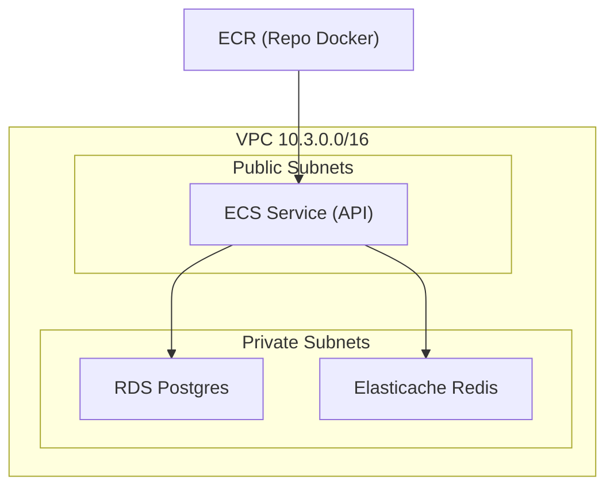

# Infraestructura en la nube

## Diagrama de la infraestructura



## Organización de la IaC con Terraform

```txt
/infra/terraform
  /modules
    /network     → Red: VPC, subnets, security groups
    /db          → Base de datos RDS Postgres
    /cache       → Elasticache Redis
    /api         → ECS Fargate + roles IAM + service
  /envs
    /dev         → Configuración de entorno dev
    /staging     → (pendiente)
    /prod        → (pendiente)
```

## 🌐 Módulo **Network** (`modules/network`)

* **VPC**: Red privada con bloque CIDR `10.3.0.0/16`.
* **Subnets**:

  * Públicas (`10.3.1.0/24`), con IP pública automática.
  * Privadas (`10.3.2.0/24` y `10.3.3.0/24`), distribuidas en distintas AZs.
* **Security Group (API)**: Grupo de seguridad para exponer la API en ECS.

> Este módulo es la base: provee conectividad, aislamiento y los IDs de subnets y SGs para los demás módulos.

## Módulo **API** (`modules/api`)

* **ECS Cluster** en Fargate (serverless).
* **IAM Role (ecs\_task\_execution)**: Permite a ECS:

  * Descargar imágenes desde ECR.
  * Enviar logs a CloudWatch.
* **Task Definition**:

  * Contenedor con la imagen de la API (`:latest` en ECR).
  * Configuración: `256 CPU`, `512 MB RAM`, puerto `8000`.
  * Variables de entorno inyectables (DB, Redis).
* **ECS Service**:

  * Levanta **1 tarea** de la API en Fargate.
  * Usa subnets públicas y el SG de la API.
  * `assign_public_ip = true` → expone la API directamente.

> La API se despliega automáticamente desde un contenedor Docker.
> La imagen se construye y publica en **ECR** antes de la creación del servicio.

## Módulo **DB** (`modules/db`)

* **RDS Postgres**:

  * Nombre: `${env}-postgres`.
  * Tipo: `db.t3.micro`.
  * Almacenamiento: `20 GiB`.
  * Usuario y contraseña configurables (`db_user`, `db_password`).
  * Seguridad:

    * Subnet Group en subnets privadas.
    * Asociado al SG de la API (para permitir acceso directo).

> La base de datos está **aislada en subnets privadas**, accesible solo desde la API.

## Módulo **Cache** (`modules/cache`)

* **Elasticache Redis**:

  * Cluster de 1 nodo (`cache.t3.micro`).
  * Puerto `6379`.
  * Subnet Group en subnets privadas.
  * Asociado al SG de la API.

> Redis funciona como **cache en memoria** para la API, también aislado en red privada.

## Infraestructura Central (`envs/dev/main.tf`)

* Define el `provider "aws"`.
* Consume los módulos `network`, `api`, `db` y `cache`.
* Crea **Subnet Groups** para RDS y Elasticache.
* Define el **repositorio ECR** de la API:

  * `aws_ecr_repository` → almacena la imagen.
  * `null_resource` con `local-exec` → hace build y push del contenedor a ECR en cada cambio del Dockerfile.
* Exporta la URL de la imagen como output.

## Flujo de despliegue

1. Terraform crea la **red base** (VPC, subnets, SG).
2. Crea **Subnet Groups** para servicios privados.
3. Provisiona **RDS Postgres** y **Elasticache Redis** en las subnets privadas.
4. Construye la **imagen Docker** de la API y la sube a **ECR**.
5. ECS Fargate levanta el **servicio API** en subnets públicas con acceso a DB y Cache.
